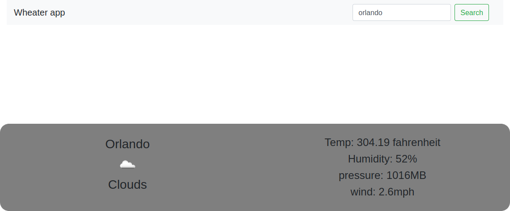

# WEATHER APP



In this project, we emulated a simple wheater app page making use of DOM manipulation elements to make the transitions in the page dynamic and the use os apis to get the information of the weather, some important features are:

* Separate Module for Display.
* Github Pages Live Link

### Built With
This project was built using these technologies.

* Javascript
* Node
* Webpack
* Bootstrap
* VSCode
* ESLint
* Stylelint
* Github Actions

### Live Demo

[Live Demo Link]()

### Running Locally

Clone the repo:
```
git clone 
```
Inside the root folder of the project, install the node packages:
```
npm install
```
Go to the root folder and run the npm build script:
```
npm run build
```
## Author

👤 Ricardo

- Github: [@ricardo123321](https://github.com/ricardo123321)

## 🤝 Contributing

Contributions, issues and feature requests are welcome!

Feel free to check the [issues page](issues/).

## Show your support

Give a ⭐️ if you like this project!

## Acknowledgments

- Thanks to Microverse and the wonderful reviewers who have guided us to the completion of this project


## 📝 License

This project is [MIT](lic.url) licensed.
 
